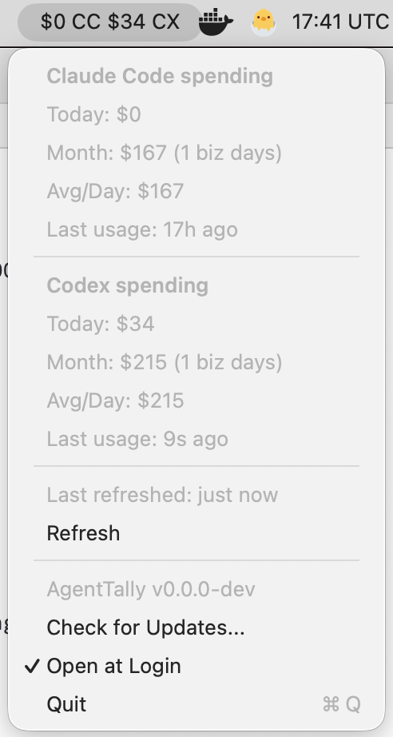

# ClaudeCost

[](https://github.com/stephanos/claudecost/releases/latest)

`ClaudeCost` is a standalone macOS menubar app that shows your Claude Code spend for today and the current month. It refreshes every 60s.



## Install

Download the latest packaged build from GitHub Releases:

- <https://github.com/stephanos/claudecost/releases>

Then:

1. Download `ClaudeCost.app.zip`
2. Unzip it
3. Move `ClaudeCost.app` to `/Applications`
4. Open `ClaudeCost.app`

On first launch, macOS may ask you to confirm opening the app.

## Development

To build from source, you need:

- `mise`

From this directory:

```sh
mise trust
mise install
mise run install
```

The install task copies the bundle to `~/Applications/ClaudeCost.app` and launches it.
It also enables "Open at Login" by default the first time the app runs.

For local development:

```sh
mise run dev
```

`mise` manages the Bun toolchain for this project and uses the system Swift toolchain. The build tasks install the local `ccusage` dependency, compile the helper, and stage both binaries into `ClaudeCost.app`.
